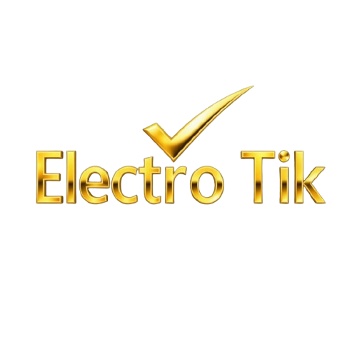
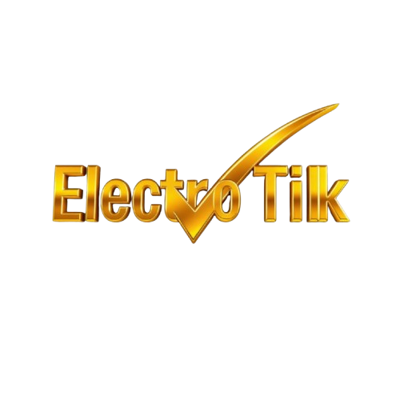
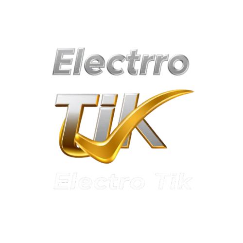
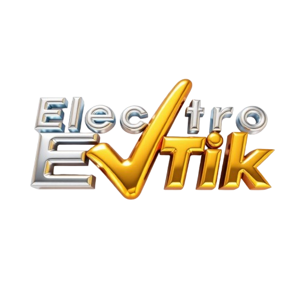

⚡ الکتروتیک ✔️ تفکر نوین

از آموزش تا اجرا؛ مهارت واقعی، نتیجه واقعی

⭐ الکتروتیک چیست؟
الکتروتیک یک مجموعهٔ آموزشی معمولی نیست؛ یک سیستم حرفه‌ای پرورش متخصص برق صنعتی است که از دل پروژه‌های واقعی، تجربه‌های میدانی و سال‌ها فعالیت عملی شکل گرفته. 
اینجا خبری از آموزش‌های تئوری، حفظیات و دوره‌های تکراری نیست. 
اینجا برق صنعتی همان‌طور که در کارخانه، تابلو برق، خطوط تولید و محیط واقعی اتفاق می‌افتد آموزش داده می‌شود.

الکتروتیک با مدیریت رضا برقی — متخصص برق صنعتی و طراح ده‌ها پروژهٔ واقعی — به یک مرجع معتبر برای آموزش عملی و ورود به بازار کار تبدیل شده.

⭐ رسالت الکتروتیک
هدف ما ساده و شفاف است:
تبدیل علاقه‌مندان به متخصصانی که واقعاً می‌توانند پروژه اجرا کنند.

در الکتروتیک، آموزش یعنی:
- مهارت واقعی
- تجربه عملی
- توانایی اجرای پروژه
- اعتمادبه‌نفس برای ورود به بازار کار
- تبدیل شدن به یک تکنسین یا مهندس قابل اتکا

⭐ چرا الکتروتیک متفاوت است؟
✔ آموزش ۱۰۰٪ عملی  
هر چیزی که آموزش داده می‌شود، قبلاً در یک پروژهٔ واقعی اجرا شده؛ از نقشه‌کشی و تابلو برق تا اتوماسیون و عیب‌یابی.

✔ زبان ساده + عمق فنی  
پیچیده‌ترین مفاهیم برق صنعتی با زبانی آموزش داده می‌شود که همه بفهمند اما هیچ‌چیزی از عمق فنی کم نشود.

✔ مسیر شغلی واقعی  
الکتروتیک فقط آموزش نمی‌دهد؛ مسیر شغلی می‌سازد.

⭐ سیستم لوگوهای انحصاری الکتروتیک
یکی از ویژگی‌های منحصربه‌فرد الکتروتیک، وجود چندین لوگوی رسمی و ثبت‌شده است که همگی تحت مالکیت مجموعه هستند.

اما چرا چند لوگوی متفاوت؟

✔ دلیل اصلی: ساختار زیرمجموعه‌های حرفه‌ای  
افرادی که مسیر آموزشی الکتروتیک را تا سطح حرفه‌ای و قابل‌تأیید مجموعه طی می‌کنند و توانایی همکاری با الکتروتیک را به‌دست می‌آورند، می‌توانند تحت شرایط مشخص، به‌عنوان زیرمجموعهٔ رسمی الکتروتیک فعالیت کنند.

این افراد اجازه دارند:
- از لوگوهای رسمی الکتروتیک
- از اعتبار برند
- از رزومهٔ درخشان مجموعه
در معرفی خود و فعالیت‌های حرفه‌ای‌شان استفاده کنند.

✔ هدف این سیستم:
- ایجاد شبکه‌ای از تکنسین‌ها و مهندس‌های تأییدشده
- حفظ استانداردهای فنی و اخلاقی
- جلوگیری از سوءاستفاده از نام الکتروتیک
- گسترش فعالیت مجموعه در سراسر کشور
- ایجاد اعتبار مشترک برای اعضای رسمی

⭐ حوزه‌های تخصصی الکتروتیک
- برق صنعتی از پایه تا پیشرفته
- طراحی و اجرای تابلو برق
- اتوماسیون صنعتی و کنترل فرایند
- آموزش PLC و سیستم‌های کنترلی
- نقشه‌کشی برق و طراحی مدار
- عیب‌یابی و تعمیرات تخصصی
- آموزش تکنسین‌های برق برای ورود به بازار کار
- تولید محتوای تخصصی و کاربردی

⭐ چرا محتوای الکتروتیک وایرال می‌شود؟
چون:
- واقعی است
- از تجربه ساخته شده
- کاربردی است
- مشکل واقعی تکنسین‌ها را حل می‌کند
- زبان ساده دارد
- پر از نکات عملی است که هیچ‌جا گفته نمی‌شود
- و هویت برند قوی پشت آن قرار دارد

⭐ کلمات کلیدی اختصاصی الکتروتیک
الکتروتیک، رضا برقی، آموزش برق صنعتی، آموزش تابلو برق، آموزش اتوماسیون، آموزش PLC، برق صنعتی بازار کار، آموزش عملی برق، طراحی تابلو برق، نقشه‌کشی برق، زیرمجموعه الکتروتیک، لوگوی رسمی الکتروتیک، برند الکتروتیک، تفکر نوین، آموزش پروژه‌محور برق
